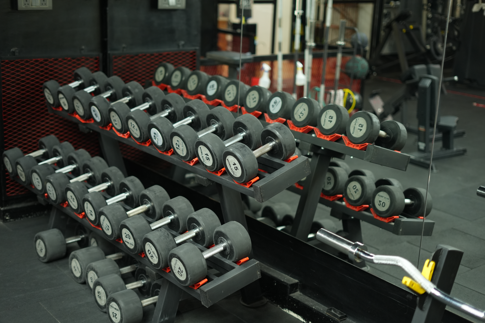

# ONYX — The Professional Fitness Studio

Production website for **ONYX — The Professional Fitness Studio** located in S.R. Nagar, Hyderabad, Telangana, India.



## 🏋️‍♂️ Highlights & Features

- **Brand Slogan**: *Train Strong • Move Better • Live Better*
- **Sleek Aesthetic**: High-contrast obsidian theme (`#050505`) with ONYX crimson accents (`#E50914`), glassmorphic navigation header, and ambient radial glow elements.
- **Official Barbell Emblem Logo**: Custom vector logo with symmetrical barbell plates and target ring icon.
- **Auto-Sliding Gym Photo Hero Carousel**: Automated background slideshow featuring studio photos with navigation controls and brightness overlay.
- **Swipeable Trainers Roster**: Interactive horizontal swipe carousel for Founder & CEO Mr. Karunesh and GGFI certified coaches (Venky, Shiva, Prashanth, Sai).
- **Purpose-Built Training Services**: Swiper carousel detailing Gym Access, 1-on-1 Personal Training, Reformer & Mat Pilates, and ONYX Hybrid protocols.
- **Official Pricing Protocol Tables**: Verbatim pricing options for Gym, PT, Friends Special, Pilates, and Hybrid memberships.
- **Small Group Transformation**: Coach-led 55-minute daily sessions (2–5 members/batch) with flexible pricing and schedule options.
- **Member Testimonials**: Verified member reviews and transformation stories.
- **Google Maps Location Integration**: Location embed for S.R. Nagar, Hyderabad studio with one-click navigation CTA.
- **Lead Capture & Appointment Form**: Lead collection connected to Google Sheets with local queue fallback.
- **Interactive Navbar**: Glowing crimson energy scroll progress bar and real-time percentage/section tracking.

---

## 🛠️ Tech Stack

- **Framework**: React 18 (TypeScript)
- **Build Tool**: Vite 6
- **Styling**: Tailwind CSS
- **Icons**: Lucide React
- **Lead Integration**: Fetch API + LocalStorage queue

---

## 🚀 Getting Started

### 1. Installation
```bash
npm install
```

### 2. Run Locally (Dev Server)
```bash
npm run dev
```
Open `http://localhost:3000/` in your browser.

### 3. Production Build
```bash
npm run build
```
Outputs optimized production bundle to `/dist`.

---

## 📍 Contact & Location

- **Studio Name**: ONYX The Professional Fitness Studio
- **Address**: S.R. Nagar, Hyderabad, Telangana 500038, India
- **Phone**: [+91 7989289409](tel:7989289409)
- **Email**: [theprofessionalfitnessstudios.1@gmail.com](mailto:theprofessionalfitnessstudios.1@gmail.com)
- **Instagram**: [@onyx.hyderabad](https://www.instagram.com/onyx.hyderabad/)
